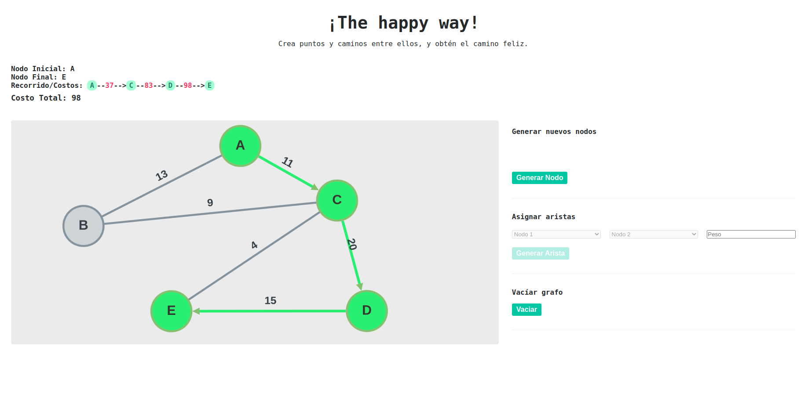

# ¡The Happy Way!

## Descripción

Este proyecto implementa un algoritmo de recorrido de red, que permite elegir el nodo inicial y los posibles nodos adyacentes hacia donde se quiera recorrer,  mostrando los nodos visitados y el costo acumulado, tomando en cuenta que cada recorrido binario incrementa el costo de las aristas de los siguientes nodos, igual a dos veces la sumatoria de los costos de las aristas no visitadas del nodo predecesor.

## Características

- Interfaz de usuario intuitiva para seleccionar el nodo inicial y nodo final y visualizar la red.
- Interfaz de usuario interactiva para crear nuevas redes.
- Dijkstra como algoritmo de recorrido de red que calcula los nodos visitados y el costo acumulado.
- Cytoscape como biblioteca para visualizar y manipular gráficos interactivos.
- Separación de responsabilidades utilizando hooks de React y archivos TypeScript.
- Estilos personalizados con Sass para una apariencia atractiva.
- Visualización de leyenda con resultados.

## Instalación
Sigue estos pasos para instalar y ejecutar el proyecto localmente:

1. Clona este repositorio en tu máquina local.
2. Ejecuta `npm install` para instalar las dependencias.
3. Ejecuta `npm run dev` para iniciar el servidor de desarrollo.
4. Abre tu navegador web y accede a `http://localhost:3000` para ver la aplicación.

## Autor
Richeidy Salcedo
[perfil de Linkedin](https://www.linkedin.com/in/richeidy-salcedo-31a283154/)
